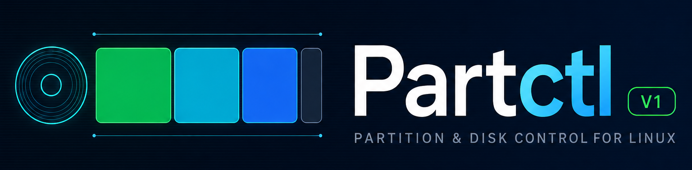
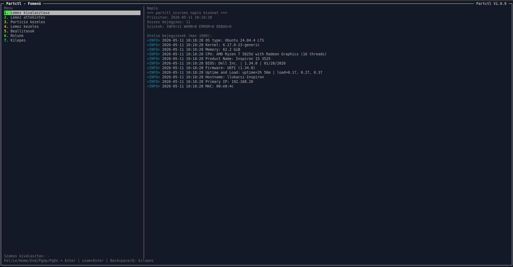

# Partctl V1 — Felhasználói kézikönyv

<p align="center">
  
</p>

A `Partctl` program egy ncurses (Python) alapú terminálos (CLI) lemez- és partíciókezelő eszköz Linux OS-ekhez. Az ötletet a GParted program adta. A projekt két fő belépési pontra bontható:

- **`partctl.sh`**: A Partctl ncurses alkalmazás indítója.
- **`setup.sh`**: Telepítő és egyben ellenőrző ncurses alkalmazás (függőségek ellenőrzése, telepítés Internet/Lokális módban)

| Telepítés | Menü rendszer | Lemez áttekintés |
| --- | --- | --- |
|  |  |  |

## Fontos biztonsági megjegyzés

Ez az eszköz **adatvesztést okozó** műveletekre képes (tábla törlés/újralétrehozás, formázás, wipe, partíció törlés, méretezés). Mindig legyen mentésed, és csak akkor folytasd, ha pontosan érted a kiválasztott művelet hatását.

## Működési elv (nagyvonalúan)

A Partctl **nem** helyettesíti a Linux lemezkezelő rétegét. Egy **menüs felület**, amely a gépen telepített, megszokott **rendszereszközöket** (partíciók, táblák, formázás, ellenőrzések stb.) indít el **lépésenként** a választásaid alapján — ezért kell jellemzően **rendszergazdai** jog: ugyanaz a felelősség, mintha ezeket a parancsokat te írnád be a terminálba.

- **Amit te látsz:** menük, rövid magyarázatok, megerősítések és **napló** — követhető marad, mi történt.
- **Amit a program a háttérben összekapcsol:** a megfelelő parancsok futtatása, figyelmeztetések és olyan ellenőrzések, amelyek csökkentik a véletlen hibák esélyét.

A **`setup.sh`** ehhez illeszkedik: megnézi, megvannak-e a szükséges eszközök, és szükség esetén **telepíti** őket, hogy a Partctl valóban végre tudja hajtani a kiválasztott műveletet.

## Gyors kezdés

1. Töltsük le a programot majd csomagoljuk ki: [LINK](https://github.com/drcyberg/partctl/releases/latest)
2. Terminálban lépj a projekt mappájába (például: `Partctl-V1-0-0`)
3. Futtasd a telepítőt/ellenőrzőt rendszergazdai jogosúltsággal (sudo/root):

```bash
bash setup.sh
```

4. Futtasd a Partctl programot rendszergazdai jogosúltsággal (sudo/root):

```bash
bash partctl.sh
```

## Követelmények

- **Linux OS**: Debian (13), Ubuntu (24.04, 26.04)
- **Program**: python3, util-linux, parted, gdisk, lvm2, e2fsprogs, dosfstools, ntfs, kpartx, fuser
- **Terminál méret**: javasolt legalább kb. 124×24 (a nagyon kicsi termináloknál a UI korlátozott)
- **Minimum képernyőfelbontás**: 1024x768

A pontos függőségi listát a `setup.sh` **Ellenőrzés** menüpontja kijelzi.

## Telepítés a `setup.sh`-val

A `setup.sh` egy ncurses telepítő UI-t indít (`setup_ncurses.py`), amely:

- **Ellenőrzi** a szükséges parancsokat/csomagokat
- **Telepíti** a hiányzókat
- Kezeli a **Nyelv** és a **Csomagkezelés (Lokális/Internet)** beállításokat (`conf/config.json`)

### Csomagforrás módok

- **Internet**: a rendszer csomagkezelőjét használja (pl. Ubuntu/Debian: `apt-get update` + `apt-get install -y ...`).
- **Lokális (offline)**: `.deb` csomagokat telepít a projekt `pack/` mappájából.

### Lokális telepítés (offline) – mappa kiválasztás disztró alapján

Ubuntu/Debian (APT) esetén a setup a rendszer `Disztro:` értékéből (pl. `Ubuntu 24.04.4 LTS`) automatikusan választ:

- Példa: **Ubuntu 24.04.x → `pack/apt/ubuntu-24-04/`**

Ha a lokális csomag mappa hiányzik vagy nem található benne `.deb`, a setup egy "Warn" panelen jelzi.

## A Partctl futtatása (`partctl.sh`)

Indítás:

```bash
bash partctl.sh
```

**Technikai megjegyzés (indítás):** a `partctl.sh` a `python3 -m partctl_ncurses_app` modult indítja; a `PYTHONPATH` a projekt gyökérkönyvtárára mutat, a `--lang-dir` paraméter pedig a `lang/` mappát adja meg a felületnek.

### Fő funkciók (röviden)

- **Lemez kezelés**: Lemez kiválasztása és áttekintése, partíció és a kötet részletek megtekintése
- **Partíció menedzsment**: létrehozás, törlés, átnevezés, méretezés, formázás, flag-ek, typecode (MBR/GPT), GPT műveletek, LVM kezelés
- **Lemez menedzsment**: ideiglenes csatolás/leválasztás, fájlrendszer javítás (támogatott típusoknál), wipe (aláírások törlése)
- **Napló panel**: a műveletek és a UI üzenetek is visszakereshetők
- **(Szín)Jelzések**: menü elemeknek a sorszám színjelzései: sárga = további almenü; zöld = művelet indító; sárga panel = figyelmeztetés; zöld panel = információ; piros panel = hiba
- **Navigálás**: numerikus számkombináció és a kurzor billentyű (navigációs billentyű) = menü elemek kiválasztása; backspace/q = vissza; enter = művelet indítás; tab = opció kiválasztása, R = újratöltés; PgUp/PgDown/Home/End = gyors lapozás
- **Nyelv**: magyar, angol

## Naplózás (logok)

A logok a `log/` mappába kerülnek.

- **Partctl**:
  - Launcher log: a `partctl.sh` hozza létre és átadja a Python UI-nak
  - Futás közbeni log: `log/partctl-YYYYMMDD-HHMMSS.log`
- **Setup**:
  - Launcher log: `log/setup-launcher-YYYYMMDD-HHMMSS.log`
  - Ncurses runtime log: `log/setup-ncurses-YYYYMMDD-HHMMSS.log`
  - Összefoglaló: `log/setup-ncurses-summary-*.log` és `log/setup-ncurses-summary-latest.log`

### UI üzenetek a naplóban

A Partctl és a Setup is úgy van kialakítva, hogy a felugró **Info/Warn/Error** panelon az üzenetek és a műveleti eredmények **naplózódjanak** (így később is visszanézhetők a log panelen / log fájlban).

## Nyelv (i18n)

- Partctl: `lang/en.json`, `lang/hu.json`
- Setup: a `setup_nc_*` kulcsok a fenti nyelvi fájlokban

A setup és a Partctl UI-ban a nyelv a menüből választható, és a beállítás mentésre kerül.

## Hibaelhárítás

### `command not found` admin eszközöknél (Debian/Ubuntu)

Egyes admin parancsok (`fdisk`, `sfdisk`, `lvm2` eszközök, stb.) gyakran `/usr/sbin` alatt vannak (Debian OS).
Az indítók ezért kiegészítik a PATH-ot:

- `export PATH="/usr/sbin:/sbin:${PATH}"`

Ha mégis hiányt jelez, futtasd a `setup.sh`-t (Ellenőrzés/Telepítés), és nézd meg a logot a `log/` alatt.

### Terminál túl kicsi

Növeld a terminál ablak méretét (vagy használj nagyobb betűméretet), majd nyomj egy gombot az újrarajzoláshoz.

## Licenc / Projekt

- [GNU General Public License v3.0](https://github.com/drcyberg/partctl/blob/main/LICENSE)
- A projekt információi a program **About / Rólunk** menüpontjában találhatók.

## További fejlesztési pontok

- [ ] További támogatott OS: Windows (WSL), Fedora, Arch
- [ ] S.M.A.R.T. támogatás
- [ ] stb

### Esettanulmány (Case Study)

- [Windows 11 rendszer partíciók beállítása](https://drcyberg.github.io/partctl/web/win11-gpt-uefi-particio-whitepaper)
- [MBR és GPT partíciós tábla ismertetése](https://drcyberg.github.io/partctl/web/mbr-vs-gpt-partctl-guide)
- [Partíció igazítás](https://drcyberg.github.io/partctl/web/particio-igazitas-partctl-guide)
- [Cisco kompatibilis USB flash és USB 3.0 SSD előkészítése](https://drcyberg.github.io/partctl/web/cisco-usb-flash-partctl-guide)
- [LVM működési elv](https://drcyberg.github.io/partctl/web/lvm-mukodesi-elv-partctl-guide)
- [Lemez tisztítás és partícionálás ismertetése](https://drcyberg.github.io/partctl/web/particio-wipe-partctl-guide)
- [GPT partíciós tábla mentés, helyreállítás és ellenőrzés ismertetése](https://drcyberg.github.io/partctl/web/gpt-tabla-mentes-helyreallitas-partctl-guide)

### Köszönöm ha támogatsz

- ***Buy me a coffee***: [LINK](https://buymeacoffee.com/drcyberg)
- ***Paypal (QR code)***: [LINK](https://github.com/drcyberg/partctl/blob/main/img/qrcode.png)
- ***Paypal (URL)***: [LINK](https://paypal.me/Kunee82)
